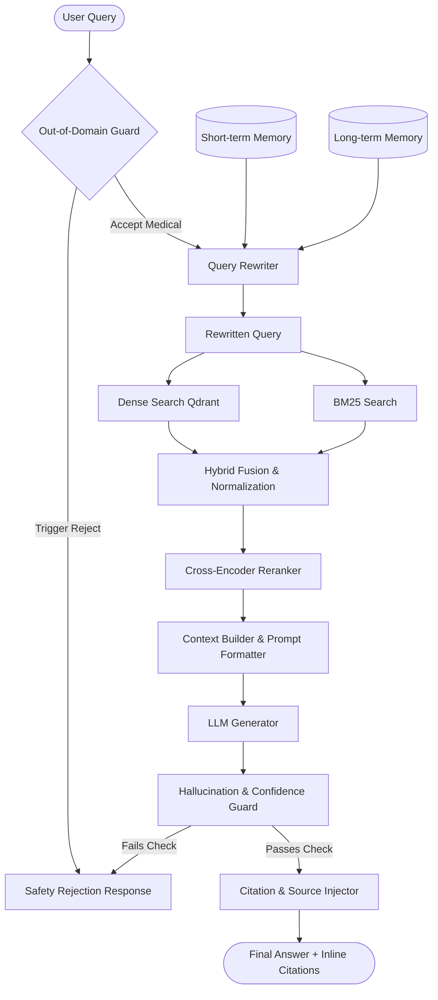

# Production Architecture Upgrade for MediTrust Medical RAG Assistant

This implementation plan details the transformation of the MediTrust Medical RAG Assistant from a Jupyter notebook prototype into a modular, production-grade AI healthcare platform. 

The architecture is designed to meet hackathon-winning and production-readiness criteria: high reliability, low-latency conversational memory, strict medical safety guardrails, clean inline citations, and modular separation of concerns.

---

## Next-Generation Production Architecture Design

The next-generation MediTrust system divides logic into modular components:
1. **API Layer (`FastAPI`)**: Handles client queries asynchronously, maintains sessions, and exposes REST endpoints.
2. **Conversational Memory Layer**:
   - **Short-Term Memory**: Keeps track of the sliding window of raw conversation turns (questions and answers).
   - **Long-Term Memory**: Extends short-term memory by asynchronously summarizing user state, discussed medical conditions, and key warnings to personalize safety constraints.
3. **Query Rewriter Layer**: Rewrites context-dependent queries (e.g., "What are its symptoms?") into self-contained search terms using recent context.
4. **Hybrid Retrieval & Reranking Layer**:
   - **Dense Retrieval**: Connects to Qdrant (using SentenceTransformers).
   - **Sparse Retrieval**: BM25 keyword search on tokenized contexts.
   - **Hybrid Score Fusion**: Normalizes and combines dense/sparse scores.
   - **Reranker**: Employs a Cross-Encoder to re-order the top retrieved documents.
5. **Guardrails & Evaluation Layer**:
   - **Out-of-Domain (OOD) Classifier**: Rejects unrelated queries (e.g., sports, coding) before RAG execution.
   - **Hallucination Validator**: Cross-checks LLM response claims against the retrieved contexts using Natural Language Inference (NLI) or a verification prompt checklist.
   - **Confidence Evaluator**: Computes confidence based on retrieval scores and LLM self-evaluation.
6. **Generation & Citation Layer**:
   - Support for multiple LLM providers: local HuggingFace Seq2Seq/Causal models (FLAN-T5, Llama-3) and API providers (OpenAI, Gemini, Anthropic).
   - Inline citation injection (mapping claims to exact numeric markers `[1]`, `[2]` linked to NIH sources).



---

## Proposed Folder Structure

We will restructure the project into a professional, modular Python package:

```
e:/RAG/v2/TrustMed_RAG/
├── all_questions_answers.csv     # NIH Dataset (source)
├── requirements.txt              # Dependency file
├── Dockerfile                    # Production containerization
├── config.yaml                   # Application configuration
├── README.md                     # Documentation for hackathons & showcases
├── src/
│   ├── __init__.py
│   ├── config.py                 # Config parser and environment variable loader
│   ├── main.py                   # FastAPI Application Entrypoint
│   ├── database/
│   │   ├── __init__.py
│   │   ├── qdrant.py             # Qdrant client connection & management
│   │   └── memory_store.py       # In-memory/Redis session and long-term memory store
│   ├── services/
│   │   ├── __init__.py
│   │   ├── retrieval.py          # Dense, BM25, Hybrid fusion, and Reranking logic
│   │   ├── memory.py             # Short-term and Long-term memory managers
│   │   ├── rewriter.py           # Conversational query rewriting logic
│   │   ├── generation.py         # Multi-backend LLM generator (local/API)
│   │   ├── guardrails.py         # Out-of-domain classifier & Hallucination/Confidence checker
│   │   └── citation.py           # Inline citation extraction and formatting
│   └── utils/
│       ├── __init__.py
│       └── helpers.py            # General helpers (text formatting, normalization)
└── tests/
    ├── __init__.py
    ├── test_pipeline.py          # End-to-end integration tests
    └── test_safety.py            # Safety boundary and guardrail verification
```

---

## Proposed Changes

### [1] Dependencies & Configuration
We will introduce `requirements.txt` and `config.yaml` to make the system fully configurable, allowing toggle between local models (e.g. `FLAN-T5` / `bge-reranker-base`) and cloud APIs.

#### [NEW] [requirements.txt](file:///e:/RAG/v2/TrustMed_RAG/requirements.txt)
Includes FastAPI, Uvicorn, Qdrant Client, Rank-BM25, Sentence-Transformers, PyYAML, and optionally openai/google-generativeai for upgraded models.

#### [NEW] [config.yaml](file:///e:/RAG/v2/TrustMed_RAG/config.yaml)
Stores LLM settings, Qdrant URLs, thresholds, and guardrail settings.

---

### [2] Database & Memory Layer
We need to handle short-term memory (chat history) and long-term memory (user conditions and discussed info) to support ChatGPT-style multi-turn chat.

#### [NEW] [memory_store.py](file:///e:/RAG/v2/TrustMed_RAG/src/database/memory_store.py)
Implements an in-memory session manager (extensible to Redis for production) that stores:
- Conversational history per session ID.
- User profiles (e.g., conditions discussed, allergies, or warnings).

---

### [3] Core Services

#### [NEW] [memory.py](file:///e:/RAG/v2/TrustMed_RAG/src/services/memory.py)
Implements `ConversationMemoryManager` to:
- Retrieve recent message history (short-term window).
- Extract medical context entity tags from past turns (e.g., "User has been asking about kidney stones").
- Summarize conversation state for long-term storage.

#### [NEW] [rewriter.py](file:///e:/RAG/v2/TrustMed_RAG/src/services/rewriter.py)
Implements `QueryRewriter` which combines the current user query with the conversation history and instructs the LLM (or a lightweight template parser) to output a self-contained query.
- *Example:*
  - History: `[{"user": "What is Parkinson's disease?"}, {"assistant": "Parkinson's is..."}]`
  - Current: `"How is it treated?"`
  - Rewritten: `"What are the treatments for Parkinson's disease?"`

#### [NEW] [retrieval.py](file:///e:/RAG/v2/TrustMed_RAG/src/services/retrieval.py)
Port the existing BM25 and Qdrant Dense logic into a clean `HybridRetriever` class that:
- Performs concurrent dense and sparse retrieval.
- Normalizes scores and combines them via weighted score fusion (0.6 dense + 0.4 sparse).
- Uses a `CrossEncoder` model (`BAAI/bge-reranker-base`) to rank the top-k documents.

#### [NEW] [guardrails.py](file:///e:/RAG/v2/TrustMed_RAG/src/services/guardrails.py)
Houses crucial medical guardrails:
1. **Out-of-Domain Guard**: Uses similarity comparison with general categories or an LLM classification step to block queries like "Who won IPL 2025?" before searching the vector database.
2. **Confidence Score**: Combines Cross-Encoder scores and LLM semantic consistency to check if context contains the answer.
3. **Hallucination Detection**: Compares generated sentences against retrieved context. If an output claim has no semantic backing in the retrieved document chunks, it flags a hallucination and falls back to a safe refusal.

#### [NEW] [generation.py](file:///e:/RAG/v2/TrustMed_RAG/src/services/generation.py)
Implements a unified LLM Client supporting:
- Local HuggingFace Seq2Seq (like `google/flan-t5-base`).
- Local Causal models via API/HuggingFace (e.g., Llama-3).
- Remote API endpoints (Gemini / OpenAI) for production quality.
Houses the new, detailed clinical prompting strategy.

#### [NEW] [citation.py](file:///e:/RAG/v2/TrustMed_RAG/src/services/citation.py)
Implements an inline citation parser. The generator is prompted to produce citations in the style of `[1]`, `[2]`. This module resolves these markers to the specific source document object containing the topic, focus, and URL, and appends a clean citation list.

---

### [4] API Entrypoint

#### [NEW] [main.py](file:///e:/RAG/v2/TrustMed_RAG/src/main.py)
FastAPI app mapping HTTP requests to the RAG services.
- POST `/chat`: Receives `session_id`, `query`. Performs query rewriting, hybrid retrieval, guardrail checks, LLM generation, citation generation, and saves the conversation history.
- GET `/history/{session_id}`: Retrieves the chat history.
- GET `/health`: System health check.

---

## Verification Plan

### Automated Tests
We will build test scripts inside the `tests/` directory:
- Run `pytest tests/test_safety.py` to assert that:
  - Out-of-domain questions ("Who won IPL 2025?") are rejected.
  - Dangerous medical claims ("Does garlic cure cancer?") are rejected or answered with high-confidence refutations based strictly on NIH data.
  - Multi-turn queries ("What is Parkinson's disease?" -> "What are its symptoms?") retrieve correct clinical contexts and rewrite query correctly.

### Manual Verification
1. We will verify the API using FastAPI's Swagger UI (`http://127.0.0.1:8000/docs`).
2. We will test conversation threads using a simple CLI script or curl requests to show how short-term context is correctly carried forward.

---

## Tech Stack Recommendations for Production
- **Compute Layer**: FastAPI, Uvicorn, Docker.
- **LLM Engine**: OpenAI `gpt-4o-mini` (highest quality for conversational memory and query rewriting) or Gemini 1.5 Flash (for large context windows and fast latency). Local backup: `Llama-3-8B-Instruct` via Ollama or HuggingFace.
- **Embedding & Reranker**: `sentence-transformers/all-MiniLM-L6-v2` and `BAAI/bge-reranker-base` (local or serverless).
- **Retrieval Engine**: Qdrant Cloud or self-hosted Qdrant docker image.
- **Cache & Memory DB**: Redis (for production session memory) or SQLite (for local hackathons).

## HIPAA-like Medical Safety Practices
- **PII Scrubbing**: Integrate a tool like Presidio before queries hit cloud LLMs to scrub patient names or health IDs.
- **Strict Evidence Grounding**: The system prompt enforces that the LLM must NOT formulate medical advice outside of retrieved context.
- **Disclaimer Injection**: Every response automatically appends a clinical disclaimer: *"MediTrust is an AI assistant, not a doctor. Consult a medical professional for clinical guidance."*
